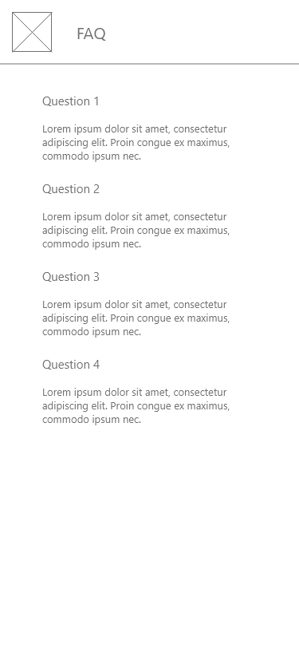

# FollowDev

## Introduction

FollowDev est une application codée en Ionic avec le framework Vue.js 3. Cet outil a pour but de créer des performances suite à des exercices et des programmes entrés par les utilisateurs connectés de l'application. Les sportifs ont également l'occasion d'imprimer leurs performances au format PDF ou même des les partager par mail, SMS ou par les réseaux sociaux.

Cette documentation comporte le guide d'installation et de déploiement de l'application en local, mais également les wireframes réalisées en amont du projet.

## Lancer le projet Ionic en local sur Android

- Cloner le dépôt Github du projet en local

```bash
git clone https://github.com/Antonyzer83/follow-dev.git && cd follow-dev
```

- Installer les dépendances NPM

```bash
npm install
```

- Installer Ionic CLI en global, si vous ne l'avez pas déjà sur votre poste

```bash
npm install -g @ionic/cli
```

- Générer le code Ionic pour la plateforme Android 

```bash
ionic capacitor build android
```

- Générer les splash screens et les icônes (automatiquement copiés dans le code précédent)

```bash
npm run resources
```

- Mettre à jour le fichier AndroidManifest.xml (pour le deep-link)

```bash
cp AndroidManifest.xml android/app/src/main/AndroidManifest.xml
```

- Lancer le projet généré précédemment sur votre appareil Android

```bash
ionic capacitor run android --target <your device>
```

## Liens utiles

- [Dépôt Github](https://github.com/Antonyzer83/follow-dev/)
- [Tableau de développement Github avec les tickets](https://github.com/Antonyzer83/follow-dev/projects/1)
- [Site statique de l'application mobile](https://followdevynov.web.app/)
- Ionic Native :
  - [Deep Link](https://capacitorjs.com/docs/guides/deep-links)
  - [Social Sharing](https://ionicframework.com/docs/native/social-sharing)
  - [PDF Generator](https://ionicframework.com/docs/native/pdf-generator)

## Wireframes

- Page de connexion


- Foire aux questions



- Liste des exercices


- Affichage d'un exercice


- Formulaire de création/MAJ d'un exercice


- Liste des programmes


- Affichage d'un programme


- Formulaire de création/MAJ d'un programme


- Liste des performances


- Affichage d'une performance


- Formulaire de création d'une performance


